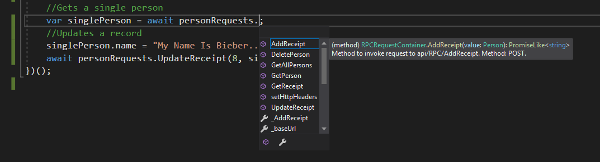
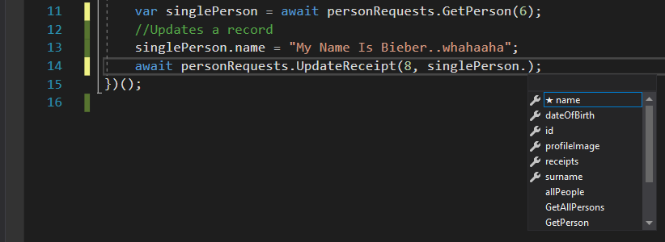

# WillCore.Requests

If you have a .NET core WebAPI project and if you are tired of typing out AJAX request after request, WillCore.Requests is the framework that will brighten your day.

---

## Features
* Supports either REST or RPC.
* Simple initialization.
* Uses reflection to generate JavaScript methods, parameters and results to mirror your WebAPI controllers. These methods can then be used to make requests to the service.
* Full Visual Studio intellisense support via docx comments.
* Outputs either:
  * ES5
    * A single file containing all the functions for each controller, action, paramter class and result class.
    * Uses a simple polyfill for promises and XMLXHR requests under the hood.
  * ES6
    * Classes that are exported as ES6 modules are generated.
    * Uses FetchAPI under the hood.
* With full IOC, the API can easily be extended or functionality can be changed. 

###### Intellisense: Methods


###### Intellisense: Result Properties


---

## Supported Platforms
WillCore.Requests is only tested with .Net Core 2.2.

## Getting Started

NuGet package coming soon. For now download the solution, build it and reference the projects. 

To enable the JS code generation add the following line in the Configure method in the Startup.cs file:

```csharp
app.GenerateJSContext<ControllerBase>(new JSClassContainer<ControllerBase>());
```

If your controller inherit from Controller use the following line:
```csharp
app.GenerateJSContext<ControllerBase>(new JSClassContainer<Controller>());
```

When you run your solution, the JavaScript files will be generated in the \js folder inside your solution.

## Excluding Controllers From The Code Generation

Sometimes a controller has to be excluded from the code generation (like MVC controllers that return views, or APIs not available for public access).

To exclude a controller, simply add a ExcludeFromAPIContract attribute to the controller.

```csharp
[ExcludeFromAPIContract]
[Route("api/[controller]")]
[ApiController]
public class ValuesController : ControllerBase
{
}
```
---
## Consuming The Service
### ES6 Mode (default mode)
WillCore.Requests builds ES6 modules for each controller. These modules can simply be imported and used. The file name the module is contained in, is the same name as the controller. The request container is name controllerName + "RequestContainer".

To import a request container for PersonController:
```javascript
import { PersonRequestContainer } from "./js/Person.js";
```

The request container is a class, to create an instance of the class, call the constructor with the base URL of your service:
```javascript
 let personRequests = new PersonRequestContainer("http://localhost:53964");
```

You can now call the actions on your service by simply invoking methods on the request container instance:

#### Rest

```javascript
//Import the request container for controller : PersonController
import { PersonRequestContainer } from "./js/Person.js";

//In order to use await, we need an async function.
(async () => {
    //Creates an instance of the request container.
    let personRequests = new PersonRequestContainer("http://localhost:53964");
    //Calls a get method to get all the people
    var allPeople = await personRequests.Get();
    //Gets a single person
    var singlePerson = await personRequests.GetById(2);
    //Updates a record
    singlePerson.name = "My Name Is Bieber..whahaaha";
    await personRequests.PutById(8, singlePerson);
})();
```

#### RPC

```javascript
//Import the request container for controller : RPCController
import { RPCRequestContainer } from "./js/RPC.js";

//In order to use await, we need an async function.
(async () => {
    //Creates an instance of the request container.
    let personRequests = new RPCRequestContainer("http://localhost:53964");
    //Calls a get method to get all the instances
    var allPeople = await personRequests.GetAllPersons();
    //Gets a single person
    var singlePerson = await personRequests.GetPerson(6);
    //Updates a record
    singlePerson.name = "My Name Is Bieber..whahaaha";
    await personRequests.UpdateReceipt(8, singlePerson);
})();
```
---
### ES5 Mode
Some people are living in the past and are still using Internet Explorer. Unfortunately there are cases where we have to cater for those poor souls and ignore the awesomeness of ES6 and later versions of JavaScript. 

To enable ES5 mode, change the line in your Startup.cs from and to the following:

```csharp
//From
app.GenerateJSContext<ControllerBase>(new JSClassContainer<Controller>());

//To
var jsCodeBuilder = new JSClassContainer<ControllerBase>();
jsCodeBuilder.Configuration.ESMode = ESMode.ES5;
app.GenerateJSContext<ControllerBase>(jsCodeBuilder);
```

A file (requestContext.js) will be generated in the js folder of your solution. If the folder does not exist, it will be created. Simply import the file and start using it. 

> ES5 mode uses a polyfill for ES6 promises. The "then" function can be used as a callback when the request is done executing.


```html
<!DOCTYPE html>
<html>
<head>
    <meta charset="utf-8" />
    <title></title>
</head>
<body>
    <h1>Test</h1>
    <!--include the generated JavaScript request context.-->
    <script src="js/requestContext.js"></script>
    <script>
        //Create a new instance of the request container
        var personRequests = new PersonRequestContainer("http://localhost:53964");
        //Use promises on the requests
        personRequests.Get().then(function (people) {
            console.log(people[0]);
            personRequests.PutById(8, people[0]).then(function (result) {
                console.log(result);
            });
            personRequests.Post(people[0]);
            personRequests.DeleteById(2);
        });
    </script>
</body>
</html>
```
---

## Specifying HTTP Request Headers
HTTP request headers such as authentication tokens can be specified globally. Headers are set on a request container instance, however they apply globally for all future requests across all request containers.

The headers can be configured via the setHttpHeaders method on a request container:
```javascript
let personRequests = new RPCRequestContainer("http://localhost:53964");
personRequests.setHttpHeaders({ AuthToken: "The Token Value" })
```

---

## Configuring Code Generation

File generation configuration can be changed on the JSClassContainer.Configuration class. To access the class in the Startup.cs:

```csharp
var jsCodeBuilder = new JSClassContainer<ControllerBase>();
jsCodeBuilder.Configuration.//Settings go here
app.GenerateJSContext<ControllerBase>(jsCodeBuilder);
```

Settings that can be changed:

Property | Type | Default Value | Description
---- | ---- | ---- | ---- |
ESMode | Enum (ESMode) | ESModeES6 | Sets the version of JavaScript that will be generated.
ModelsFolder | String | "models" | The folder under the output directory that will contain the ES6 result modules.
SingleFileOutputName | String | "requestContext.js" | The file name of the generated ES5 JavaScript file containing all the request logic.
MultiFileOutput | bool | true | Indicates if all the generated code will be consolidated into a single file or be separated into multiple files.
OutputDirectory | String | "js" | The folder where the generated JavaScript code will saved in.

---

#### Swapping Code Generation Implementations

Implementations used for code generations can be swapped out via the dependency container. All code building functionality can be swapped out.

For more information on available modules, please see source code.

For example, to swap out the docx comments in the generated files with XML comments:

From docx:
```javascript
/**
* Method to invoke request to api/Person/{personId}/{receiptId}. Method: GET.
* @param {Number} personId
* @param {Number} receiptId
* @return {PromiseLike<Receipt>}
*/
```

To XML:

```javascript
//===============================================
//<summary>Method to invoke request to api/Person/{personId}/{receiptId}. Method: GET.</summary>
//<param>CodeBulder.JS.Types.JSNumber</param>
//<typeparam>Number</typeparam>
//<param>CodeBulder.JS.Types.JSNumber</param>
//<typeparam>Number</typeparam>
//<returns>PromiseLike<Receipt></returns>
//===============================================
```

Simply make a class "JSXMLComment.cs" and place it in your project. Inherit it from JSRenderble and IComment:

```csharp
public class JSXMLComment : JSRenderble, IComment
{
    public bool? IsPublic { get; set; }
    public JSType ReturnType { get; set; }
    public IDictionary<string, JSType> Params { get; set; }
    public JSType Type { get; set; }
    public string Description { get; set; }
    public JSXMLComment() {
        Params = new Dictionary<string, JSType>();
    }

    public new String GetText()
    {
        var result = new StringBuilder();
        result.AppendLine("//===============================================");
        if (Description != null)
        {
            result.AppendLine($"//<summary>{Description}</summary>");
        }
        if (IsPublic.HasValue)
        {
            result.AppendLine(IsPublic.Value ? "//<access>Public</access>" : "</access>Private</access>");
        }
        if (Type != null)
        {
            result.AppendLine($"//<returns>{Type.JSTypeDef}</returns>");
        }
        foreach (var key in Params.Keys)
        {
            result.AppendLine($"//<param>{Params[key]}</param>");
            result.AppendLine($"//<typeparam>{Params[key].JSTypeDef}</typeparam>");
        }
        if (ReturnType != null)
        {
            result.AppendLine($"//<returns>{ReturnType.JSTypeDef}</returns>");
        }
        result.Append("//===============================================");
        return result.ToString();
    }
}
```

Now you can register the new code generation module in your Startup.cs:

```csharp
var jsCodeBuilder = new JSClassContainer<ControllerBase>();
jsCodeBuilder.InstanceConfiguration.CreateComment = () => new JSXMLComment();
app.GenerateJSContext<ControllerBase>(jsCodeBuilder);
```

All generated code should now have XML instead of docx comments.

### Licence
This project is licensed under the MIT License

### Author
Philip Schoeman